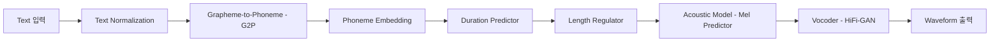
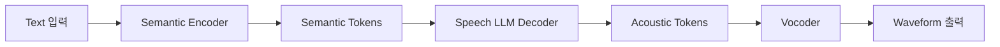
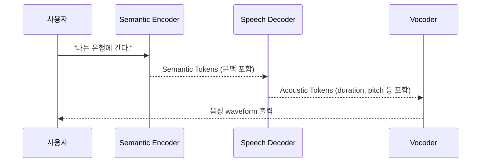
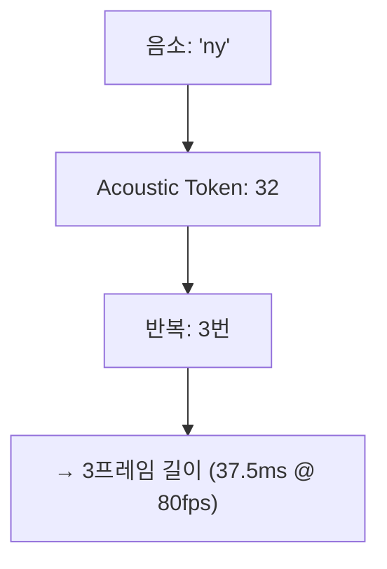

# 🧠 TTS의 진화: LLM 등장 이전 vs 이후

---

## 📚 목차

- [🏗️ LLM 등장 이전 TTS의 원리 (FastSpeech2 기반)](#llm-before)
- [🧠 LLM 기반 TTS의 작동 원리 (Semantic Token, Duration 포함)](#llm-after)


<h2 id="llm-before">🏗️ LLM 등장 이전 TTS의 원리 (FastSpeech2 기반 예시 포함)</h2>

---

## 🎯 개요

전통적인 TTS 시스템은 다음과 같은 **모듈형 파이프라인**으로 구성됩니다:

```
Text → Text Normalization → G2P → Phoneme Embedding → Duration Predictor
   → Length Regulator → Acoustic Model (e.g., Mel-spectrogram) → Vocoder → Waveform
```

각 단계는 독립적인 모델 또는 알고리즘으로 구성되며, 전체 시스템은 병렬 또는 순차적으로 동작합니다.

---

## 📌 전체 구조 (FastSpeech2 기반)





## 🧪 예시: `"안녕하세요"`

### 1️⃣ Text Normalization

입력 텍스트 `"안녕하세요"`는 숫자, 약어, 기호 등을 정규화합니다.  
이 문장은 단순하여 변환 없음.

```text
"안녕하세요" → "안녕하세요"
```

---

### 2️⃣ G2P (Grapheme-to-Phoneme)

```python
Input: "안녕하세요"
→ Output: ["a", "n", "ny", "eo", "ng", "h", "a", "se", "yo"]
```

이 과정은 한글 자소/음소를 추출하거나 음운 규칙에 따라 변형할 수 있습니다.

---

### 3️⃣ Phoneme Embedding

각 음소는 고정된 차원의 임베딩 벡터로 변환됩니다.

```python
embedding("a") → x₁ ∈ ℝ²⁵⁶
embedding("n") → x₂ ∈ ℝ²⁵⁶
...
```

전체 시퀀스:
```python
X = [x₁, x₂, ..., x₉]  # (9, 256)
```

---

### 4️⃣ Duration Prediction

각 음소가 몇 frame 길이로 발음될지를 예측합니다.

```python
durations = [5, 3, 4, 6, 2, 3, 5, 3, 4]  # 총 frame 수 = 35
```

---

### 5️⃣ Length Regulator

Duration에 따라 음소 임베딩을 시간 축으로 반복합니다.

```python
expanded = []
for x, d in zip(phoneme_embeddings, durations):
    expanded.extend([x] * d)

expanded.shape = (35, 256)
```

---

### 6️⃣ Acoustic Model (Mel predictor)

Length Regulator 결과를 기반으로 **Mel-spectrogram**을 예측합니다.

```python
mel = acoustic_model(expanded)  # mel.shape = (35, 80)
```

---

### 7️⃣ Vocoder

Mel-spectrogram → Waveform 변환

```python
waveform = vocoder(mel)  # torch.Size([56000]) for 3.5초 at 16kHz
```

---

## 📐 수식 요약

1. 임베딩
   $$x_i = \text{Embedding}(p_i), \quad \text{where } p_i \text{ is the i-th phoneme}$$

2. Duration 예측
   $$d_i = \text{DurationPredictor}(x_i)$$

3. Length Regulator
   $$\tilde{X} = \bigcup_{i=1}^{N} [x_i]^{\times d_i}$$

4. Mel 예측
   $$\hat{Y}_{mel} = \text{AcousticModel}(\tilde{X})$$

5. Waveform 생성
   $$\hat{y} = \text{Vocoder}(\hat{Y}_{mel})$$

---

## 📊 각 구성요소 비교

| 구성 요소 | 역할 | 예시 모델 |
|-----------|------|------------|
| Text Normalizer | 기호/숫자 정규화 | hand-crafted |
| G2P | 자소/음소 변환 | KoG2P, g2pk |
| Embedding | 음소 임베딩 | 256~512D |
| Duration Predictor | 발음 길이 예측 | FastSpeech2 내부 |
| Length Regulator | 시간축 확장 | FastSpeech 시그니처 |
| Acoustic Model | Mel 예측 | Transformer |
| Vocoder | Mel → Waveform | HiFi-GAN, WaveGlow, WaveNet |

 <h2 id="llm-after">🧠 LLM 기반 TTS의 작동 원리 (Semantic Token, Duration 포함 상세 설명)</h2>

---

## ✅ 전체 구조 개요

```
Text
 ↓
[Semantic Encoder (GPT 기반)]
 ↓
Semantic Tokens  ← 의미 단위 토큰 (동음이의어 구분 포함)
 ↓
[Speech LLM Decoder]
 ↓
Acoustic Tokens  ← duration, pitch, timbre 등 포함
 ↓
[Vocoder]
 ↓
Waveform
```

---

## 🧠 핵심 아이디어

LLM 기반 TTS는 기존 TTS와 다르게, 텍스트를 직접 Mel-spectrogram으로 예측하거나 음성 신호를 생성하지 않습니다.  
대신 다음과 같은 3단계로 구성됩니다:

1. **텍스트 → 의미 토큰(Semantic Token)**  
2. **의미 토큰 → 소리 토큰(Acoustic Token)**  
3. **소리 토큰 → 실제 waveform**  

이러한 구조는 기존 TTS보다 자연스러운 억양, 감정, 화자 보존이 훨씬 뛰어납니다.

---

## 1️⃣ Semantic Token: 의미 기반 토큰

### 📌 정의
- 텍스트 문장에서 **"무엇을 말할 것인가"**를 표현하는 단위.
- 일반 wordpiece 토큰이 아닌, **음성 생성을 위한 의미 표현 단위**로 학습됨.

### 🔍 학습 방식
- 대규모 텍스트-음성 데이터에서 **self-supervised 방식으로 joint representation 학습**
- 예시: GPT를 기반으로 한 텍스트 인코더와 오디오 인코더를 align하여 학습

### 🎯 핵심 기능
| 기능 | 설명 |
|------|------|
| 의미 분별 | 동음이의어도 문맥에 따라 구분됨 |
| 발화 의도 반영 | 질문/명령/의문 같은 문장 행위 구분 |
| 억양 힌트 내포 | prosody 예측에 유리한 token 분리 |

### 🧠 예시
```
입력: "나는 은행에 간다."
Semantic Tokens = [201, 834, 2, 911, 421]
(여기서 834는 문맥상 '금융기관' 의미로 선택됨)
```

---

## 2️⃣ Duration 포함 Acoustic Token 생성

### 🛠️ 역할
- Speech LLM은 semantic token 시퀀스를 기반으로 **acoustic token 시퀀스**를 예측합니다.
- 이 token들은 다음 요소를 모두 암묵적으로 포함합니다:
  - **Duration**: 각 음소를 얼마나 길게 말할지
  - **Pitch**: 높낮이
  - **Timbre**: 화자 음색
  - **Prosody**: 억양 흐름

### 🔁 Duration 표현 방식
FastSpeech2처럼 명시적인 duration prediction 대신, **token 반복 횟수로 간접 표현**됩니다.

예시:
```text
Semantic Token: [201, 834, 2, 911, 421]
 ↓
Acoustic Token: [78, 32, 32, 32, 87, ..., 208]
```

→ 여기서 `32`가 3번 반복 → 특정 음소가 **3 프레임 길이**로 표현됨

---

## 3️⃣ Vocoder: Acoustic Token → Waveform

- acoustic token은 `EnCodec`, `SoundStream` 등으로 양자화된 discrete code index입니다.
- Vocoder는 이 token 시퀀스를 waveform으로 복원합니다.

```python
waveform = vocoder(acoustic_tokens)  # e.g., 24kHz waveform 출력
```

---

## 🧩 전체 예시: Bark 스타일

### 입력 텍스트
```
"Hello, my name is Alice."
```

### 처리 예시
```python
# Step 1: Semantic Encoding
semantic_tokens = [428, 1002, 201, 7, 844, 391, 387]

# Step 2: Acoustic Decoding
acoustic_tokens = [
    78, 32, 32, 32,    # "Hel..."
    120, 203, 1,       # "lo,"
    92, 92,            # "my"
    ...
]  # 총 1024 tokens

# Step 3: Waveform reconstruction
waveform = vocoder(acoustic_tokens)
```

---

## 📐 수식 요약

1. 텍스트 → 의미 토큰
   $$S_{1:N} = f_{\text{semantic}}(\text{Text})$$

2. 의미 토큰 → 음향 토큰 (duration 포함)
   $$A_{1:T} = f_{\text{acoustic}}(S_{1:N})$$

3. 음향 토큰 → 파형
   $$hat{y}_{1:L} = text{Vocoder}(A_{1:T})$$

---

## 📊 Semantic vs Acoustic Token 비교

| 항목 | Semantic Token | Acoustic Token |
|------|----------------|----------------|
| 의미 | 무엇을 말할지 | 어떻게 말할지 |
| 역할 | 의미/문맥/문장 의도 표현 | duration/pitch/timbre 포함 |
| 형식 | 정수 인덱스 (e.g., 428) | codebook index (e.g., 78) |
| 길이 | 수십 개 | 수백~천 개 |
| 예시 모델 | GPT encoder | GPT-style decoder |

---

## ✅ 결론

- Semantic token은 **문맥 기반 의미 단위**, 동음이의어와 억양 힌트까지 포함
- Acoustic token은 **음향 정보를 세밀하게 분해한 discrete 표현**
- Duration은 token 반복 횟수로 자연스럽게 표현되며, 명시적 예측이 필요 없음
- 전체 파이프라인은 end-to-end이며, 감정·화자 보존·자연스러운 발화 가능

---

## 🔎 참고 모델 요약

| 모델명 | Semantic→Acoustic 방식 | Duration 표현 |
|--------|------------------------|----------------|
| **Bark** | End-to-End LLM | Token 반복 |
| **AudioLM** | Multi-stage LMs | Token 시계열 |
| **VALL-E** | Prompt + Text → token | 고정 길이 프레임 |
| **SoundStorm** | AR token generator | 정렬된 time-synced token |

---

## 🗺️ Mermaid 다이어그램

### 📌 구조 흐름도



---

### 🕒 처리 순서 시퀀스



---

### 🧬 Duration 표현 방식 예시


---

## ✅ 결론

- LLM 이전 TTS는 **모듈화되고 해석 가능한 구조**였음
- Duration은 **명시적으로 예측**되며, 억양이나 길이 조절이 가능했음
- 단점: 파이프라인 복잡, 감정/자연스러움 표현 한계
- 장점: 모델 디버깅 및 분석 용이

